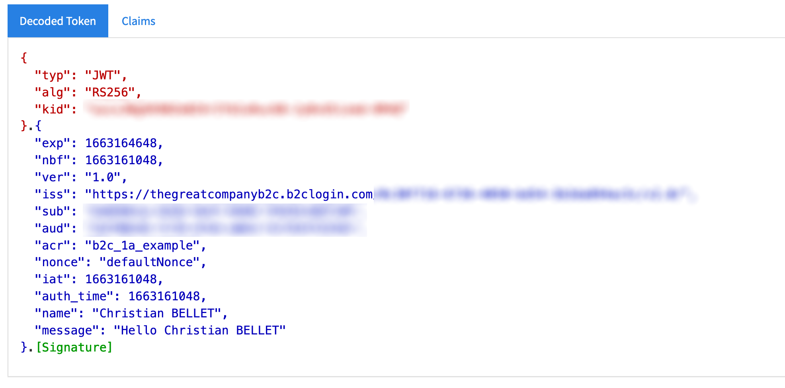
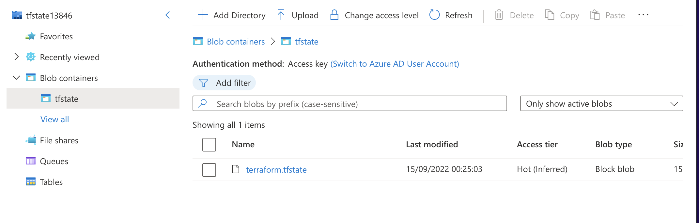

# Azure AD B2C IEF Custom policies

## Presentation

This is a custom repository that contains examples of custom policies to interact with Azure Active Directory (AAD) B2C with the Identity Experience Framework (IEF).

The response:

## The TrustFrameworkPolicy Schema

The policies are defined into an XML format.

The XML tags belows are part of a AAD B2C policy:

- **BasePolicy** This section contains elements that are used to build an inheritance hierarchy among policy files. We won’t present this section here – it will be discussed in detail in the Hello! It’s Time To Clean Up a Bit post a bit later in this series.
- **BuildingBlocks** This section can be considered the “specification” section of the policy – it includes declarations for claims (which act as the “variables” in a policy), data transformation utilities, user interface content and controls, and localization configuration. The elements defined in here are later leveraged by the policy’s “functions” in the ClaimsProviders and RelyingParty sections.
- **ClaimsProviders** This section defines items which can be considered the executable functions of the programming language, expressed as units called Technical Profiles.
- **UserJourneys** This section defines the sequence of steps that are executed when the policy is invoked and the conditions under which each step is either invoked or skipped.
- **RelyingParty** This section defines the behavior of the endpoint that is exposed by the policy. The primary purpose of this element is to define which UserJourney is executed and which claims are returned by the policy, although there are other settings that can also be defined.

Form more information, have a look at the [online documentation](https://docs.microsoft.com/en-us/azure/active-directory-b2c/trustframeworkpolicy).

## Terraform

Terraform is used in this project to deploy the backend state first.

